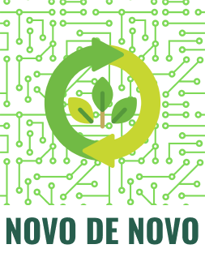

<!-- PROJECT LOGO -->
<br />
<p align="center">
  <a href="https://github.com/othneildrew/Best-README-Template">
    
  </a>

  <h2 align="center">Hackathon CCR 2ª Edição</h2>
  <h3 align="center">Projeto Novo de Novo</h3>

<!-- ABOUT THE PROJECT -->

## Sobre o projeto

Anualmente o Brasil produz mais de 2 milhões de toneladas de lixo eletrônico e, dessa quantidade, apenas cerca de 3% é reciclado. Mas apesar da quantia exorbitante de eletrônicos descartados, o país tem uma distribuição desigual de equipamentos digitais: para cada 10 habitantes há 16 celulares, tablets ou notebooks e, ainda assim, 46 milhões de cidadãos brasileiros são excluídos digitalmente.
Dentre as consequências dessa exclusão está o desempenho menor de candidatos no ENEM que não têm acesso à Internet nem computador. Os dados do Inep mostram que em 2018 quase metade dos candidatos no Brasil não tinham computador e suas notas foram menores do que as daqueles que tinham maior acesso à tecnologia.
José, de 17 anos, estava cursando o terceiro ano do ensino médio em 2020, quando teve seus estudos interrompidos pela quarentena. Como não tem computador para assistir às aulas online de forma adequada, se viu obrigado a desistir do ENEM para ajudar em casa, tendo que adiar o sonho de se tornar o primeiro engenheiro da família.
Já a Jéssica, 41 anos, tem um computador antigo que não usa mais e não sabe o que fazer com ele, qual seria o valor desse equipamento e nem qual seria a melhor forma de descartá-lo.
E se esse computador antigo da Jéssica pudesse ser reparado e reutilizado pelo José para que ele tivesse a oportunidade de entrar no mundo digital, concluir o ensino médio e conseguir a sonhada aprovação no vestibular?
É aí que nasce a Novo De Novo. Nossa solução consiste em utilizar nossa central de tratamento de lixo eletrônico que emprega primariamente jovens. Queremos que essas pessoas participem de forma ativa no processo de triagem, separação e restauração de equipamentos eletrônicos, de forma guiada e supervisionada para que haja aprendizado e capacitação profissional. Durante o estágio, o jovem estará apto a levar para si um computador que restaurou utilizando do conhecimento adquirido.

### Construído com

- React Native
- Typescript
- Node.js
- React

## Instruções para rodar o projeto na sua máquina

### Pré-requisitos

Lista de softwares necessários para rodar o projeto na máquina

- `npm`: node package manager
  ```sh
  npm install npm@latest -g
  ```
- `yarn`

  ```sh
  curl -sS https://dl.yarnpkg.com/debian/pubkey.gpg | sudo apt-key add -
  echo "deb https://dl.yarnpkg.com/debian/ stable main" | sudo tee /etc/apt/sources.list.d/yarn.list

  sudo apt update && sudo apt install yarn
  ```

- `Expo CLI`

  ```sh
  npm install -g expo-cli
  ```

- `Expo Client`: baixe o cliente

### Instalação

1. Clone o repositório
   ```sh
   git clone https://github.com/hacka-ccr/ccr-mobile
   ```
2. Instale os pacotes NPM utilizando o `yarn`
   ```sh
   yarn
   ```
   <!-- USAGE EXAMPLES -->

## Uso

Após verificar que todas os pré-requisitos são cumpridos e instalar o repositório, para utilizá-lo, basta executar um único comando:

```sh
yarn start
```

Isso dará início ao projeto no endereço `localhost:3000`

   <!-- USAGE EXAMPLES -->

_For more examples, please refer to the [Documentation](https://example.com)_

<!-- ROADMAP -->

## Roadmap

See the [open issues](https://github.com/othneildrew/Best-README-Template/issues) for a list of proposed features (and known issues).

<!-- CONTRIBUTING -->

## Contributing

Contributions are what make the open source community such an amazing place to be learn, inspire, and create. Any contributions you make are **greatly appreciated**.

<!-- LICENSE -->

## License

Distributed under the MIT License. See `LICENSE` for more information.

<!-- CONTACT -->

## Contact

Your Name - [@your_twitter](https://twitter.com/your_username) - email@example.com

Project Link: [https://github.com/your_username/repo_name](https://github.com/your_username/repo_name)
